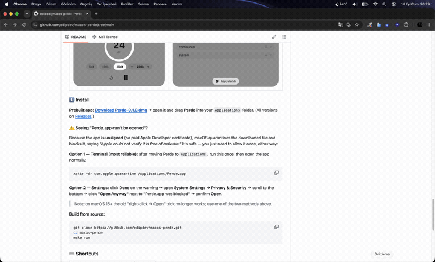

<div align="center">


# Perde

**macOS için çentik (notch) tabanlı, çok amaçlı bir yardımcı.**
_A notch‑based multi‑tool for macOS._


[-brightgreen)](https://github.com/edipdev/macos-perde/releases/download/0.1.0/Perde-0.1.0.dmg)

[Türkçe](#türkçe) · [English](#english)

</div>

---

## Türkçe

Fareyi ekranın üst‑orta **çentik** bölgesine götürünce açılan; müzik, çeviri,
zamanlayıcı ve pano yöneticisini tek yerde toplayan bir menü‑çubuğu uygulaması.
Dock'ta ikonu yoktur.

### ✨ Özellikler

- 🎵 **Müzik** — Apple Music & Spotify: albüm kapağı, kayan başlık, sürüklenebilir
  ilerleme (seek), oynat/duraklat/ileri/geri, karıştır/tekrar, ses, favori (Apple
  Music) ve **şarkı sözleri** (lrclib.net). Kapalıyken çentiğin kenarlarında mini
  kapak + canlı ekolayzer.
- 💬 **Çeviri** — Apple'ın **cihaz‑üstü** Translation motoru (ücretsiz, internetsiz,
  API anahtarsız): 19 dil, kaynak/hedef değiştirme, dil algılama, sesli okuma,
  sözlük, pano otomatik doldurma ve geçmiş.
- ⏱ **Zamanlayıcı** — halka göstergeli geri sayım, özel süre ve **Pomodoro**
  (çalış/mola otomatik döngü + seans sayacı). Kapalıyken çentikte mini halka.
- 📋 **Pano** — kopyalananların aranabilir geçmişi; **sabitleme**, link ve görsel
  önizleme.
- 🎨 **Tema** — Siyah veya Açık; seçilebilir **vurgu rengi**.
- ⌨️ **Global kısayollar**, girişte otomatik başlatma, çoklu monitör, tam ekranda
  gizlenme.

### 📸 Ekran görüntüleri

| Müzik | Çeviri |
|:---:|:---:|
|  |  |
| **Zamanlayıcı** | **Pano** |
|  |  |

### ⬇️ Kurulum

<p align="center"></p>

**Hazır uygulama:** [**Perde-0.1.0.dmg indir**](https://github.com/edipdev/macos-perde/releases/download/0.1.0/Perde-0.1.0.dmg) →
aç ve **Perde**'yi `Applications` klasörüne sürükle. (Tüm sürümler için [Releases](https://github.com/edipdev/macos-perde/releases).)

#### ⚠️ "Perde.app Açılmadı" uyarısı alıyorsan

Uygulama **imzasız** (ücretli Apple geliştirici sertifikası yok) olduğu için macOS,
indirilen dosyaya karantina koyar ve _"Apple, kötü amaçlı yazılım içermediğini
doğrulayamadı"_ diyerek açmayı engeller. Zararsızdır — bir kez izin vermen yeterli.
İki yoldan biriyle:

**Yöntem 1 — Terminal (en garanti):** Perde'yi `Applications`'a taşıdıktan sonra
Terminal'de şu komutu çalıştır, sonra uygulamayı normal aç:

```bash
xattr -dr com.apple.quarantine /Applications/Perde.app
```

**Yöntem 2 — Ayarlar:** Uyarıda **Bitti**'ye bas → **Sistem Ayarları → Gizlilik ve
Güvenlik**'i aç → en alta in → "Perde.app engellendi" satırındaki **"Yine de Aç"**a
bas → çıkan pencerede tekrar **Aç** de.

> Not: macOS 15+ sürümlerinde eski "sağ tık → Aç" yöntemi artık çalışmıyor; yukarıdaki
> iki yoldan birini kullan.

**Kaynaktan derleme:**

```bash
git clone https://github.com/edipdev/macos-perde.git
cd macos-perde
make run
```

### ⌨️ Kısayollar

| İşlem | Varsayılan |
|---|---|
| Çentiği aç/kapat | `⌥⌘P` |
| Çeviriyi aç (panodan) | `⌥⌘T` |

Kısayollar menü çubuğu → **Ayarlar…**'dan değiştirilebilir.

### 🔒 İzinler

- **Otomasyon** — Apple Music/Spotify'ı okumak ve kontrol etmek için (ilk kullanımda sorulur).

### 🛠 Gereksinimler

macOS 15+ · Xcode / Swift 6 (derleme için).

---

## English

A menu‑bar app that lives in your Mac's **notch**: hover to reveal a music player,
translator, timer and clipboard manager — all in one place. No Dock icon.

### ✨ Features

- 🎵 **Music** — Apple Music & Spotify: artwork, marquee title, draggable seek,
  transport, shuffle/repeat, volume, favorite (Apple Music) and **lyrics**
  (lrclib.net). Mini artwork + live equalizer in the collapsed notch.
- 💬 **Translate** — Apple's **on‑device** Translation (free, offline, no API key):
  19 languages, swap, language detection, text‑to‑speech, dictionary, clipboard
  autofill and history.
- ⏱ **Timer** — ring countdown, custom duration and **Pomodoro** (auto work/break
  cycle + session counter). Mini ring in the collapsed notch.
- 📋 **Clipboard** — searchable history with **pinning**, link and image previews.
- 🎨 **Themes** — Black or Light; selectable **accent color**.
- ⌨️ **Global shortcuts**, launch at login, multi‑monitor, hide in fullscreen.

### 📸 Screenshots

| Music | Translate |
|:---:|:---:|
|  |  |
| **Timer** | **Clipboard** |
|  |  |

### ⬇️ Install

<p align="center"></p>

**Prebuilt app:** [**Download Perde-0.1.0.dmg**](https://github.com/edipdev/macos-perde/releases/download/0.1.0/Perde-0.1.0.dmg) →
open it and drag **Perde** into your `Applications` folder. (All versions on [Releases](https://github.com/edipdev/macos-perde/releases).)

#### ⚠️ Seeing "Perde.app can't be opened"?

Because the app is **unsigned** (no paid Apple Developer certificate), macOS quarantines
the downloaded file and blocks it, saying _"Apple could not verify it is free of
malware."_ It's safe — you just need to allow it once, either way:

**Option 1 — Terminal (most reliable):** after moving Perde to `Applications`, run this
once, then open the app normally:

```bash
xattr -dr com.apple.quarantine /Applications/Perde.app
```

**Option 2 — Settings:** click **Done** on the warning → open **System Settings →
Privacy & Security** → scroll to the bottom → click **"Open Anyway"** next to
"Perde.app was blocked" → confirm **Open**.

> Note: on macOS 15+ the old "right-click → Open" trick no longer works; use one of the
> two methods above.

**Build from source:**

```bash
git clone https://github.com/edipdev/macos-perde.git
cd macos-perde
make run
```

### ⌨️ Shortcuts

| Action | Default |
|---|---|
| Toggle notch | `⌥⌘P` |
| Open translate (from clipboard) | `⌥⌘T` |

Change them in the menu bar → **Settings…**

### 🔒 Permissions

- **Automation** — to read and control Apple Music / Spotify (asked on first use).

### 🛠 Requirements

macOS 15+ · Xcode / Swift 6 (to build).

---

## Proje yapısı / Project layout

```
Sources/Perde/
  main.swift, AppDelegate.swift   # giriş, menü çubuğu, kısayollar, ayarlar
  Notch/                          # pencere, geometri, controller
  Input/                          # global fare izleme
  NowPlaying/                     # AppleScript kaynakları, servis, sözler
  Translation/                    # çeviri geçmişi + TTS
  System/                         # zamanlayıcı, pano, kısayol, ayarlar
  Views/                          # SwiftUI arayüz
Tests/PerdeTests/                 # birim testler
```

## Lisans / License

[MIT](LICENSE)
